# Based on Windows

## Thonny develops software

### Install development software Thonny

* Development software refers to the tools we use to write code. There are many programs for Python. If you have mastered python or have used python to develop, you can directly use the development software you are used to to program. If you are a beginner or like simple and fast application, we use the official recommended Thonny Python IDE.
* Thonny Python IDE is an open source software, designed in a minimalist way, and is very friendly to MicroPython compatibility. And it supports Windows, Mac OS, Linux, and Raspberry Pi. Due to the open source, the software iteration speed is very fast, and the functions are becoming more and more mature. The specific installation method is as follows:

    * The latest version of this software can be downloaded from [https://thonny.org/](https://thonny.org/), and you can choose your own development platform to download and install (choose Windows here!):

    <figure><figcaption></figcaption></figure>

* After the download is complete, just double-click to open the installation. After the installation is complete, you can see the relevant icon on the desktop. Open the software as follows:

<figure><figcaption></figcaption></figure>

* So far, Thonny installation is complete. About how to use Vobot Clock Tiny on Thonny, we will explain in detail in the next chapter.

## Development test suite usage

### Driver Installation

* **Vobot Clock Tiny** uses the built-in USB virtual serial port of the **ESP32-C3** chip, and connects to the computer via type-c.

<figure>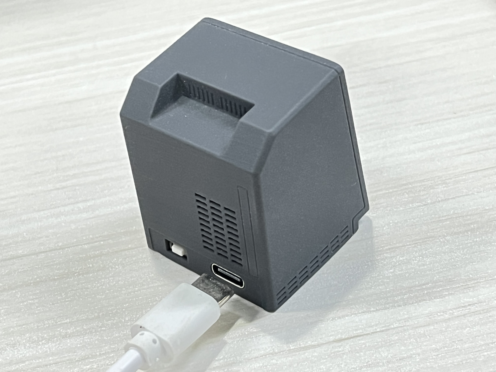<figcaption><p>Connect to computer via Type-C cable</p></figcaption></figure>

* The computer will automatically install the driver. Right-click “My Computer”—Properties—Device Manager: If the serial port **COM** number appears, the driver installation is successful, as shown in the figure below. (It is recommended to use the Win10 system, and some Win7 systems cannot automatically install the driver.)

<figure>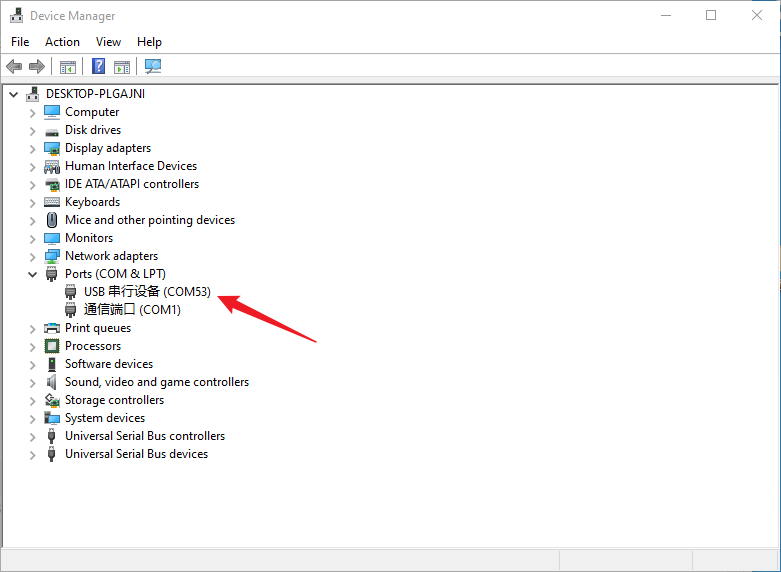<figcaption><p>Serial port driver installed successfully</p></figcaption></figure>

### REPL serial port interactive debugging

* The **MicroPython** firmware of **Vobot Clock Tiny** integrates the interactive interpreter REPL [Read (Read)-Operation (Eval)-Output (Print)-Cycle (Loop)], so developers can directly through the serial port Terminal to debug the development board. We turn on Thonny and connect the board to the computer. Click on the bottom right corner:

<figure>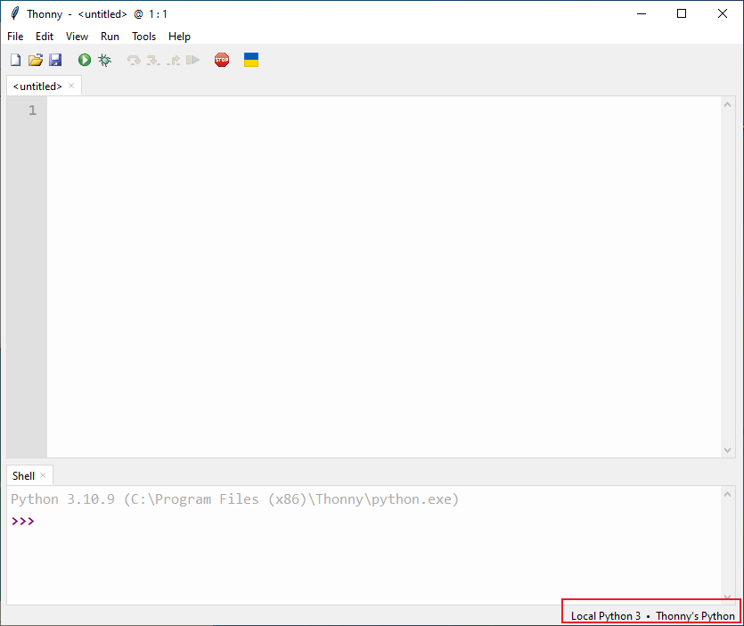<figcaption><p>Select a device to connect</p></figcaption></figure>

* Select from the pop-up list: **Configure interpreter**

<figure>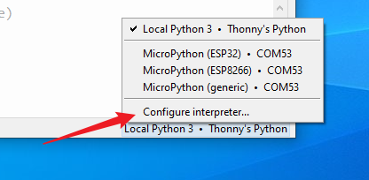<figcaption></figcaption></figure>

* Select "MicroPython (ESP32)" and the corresponding serial port number of the development board, and click OK.

<figure>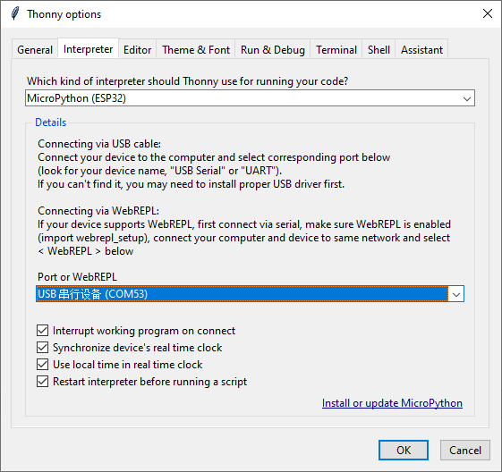<figcaption><p>Select the development board type</p></figcaption></figure>

* After the connection is successful, you can see the relevant information of the firmware in the shell (serial port terminal):

<figure>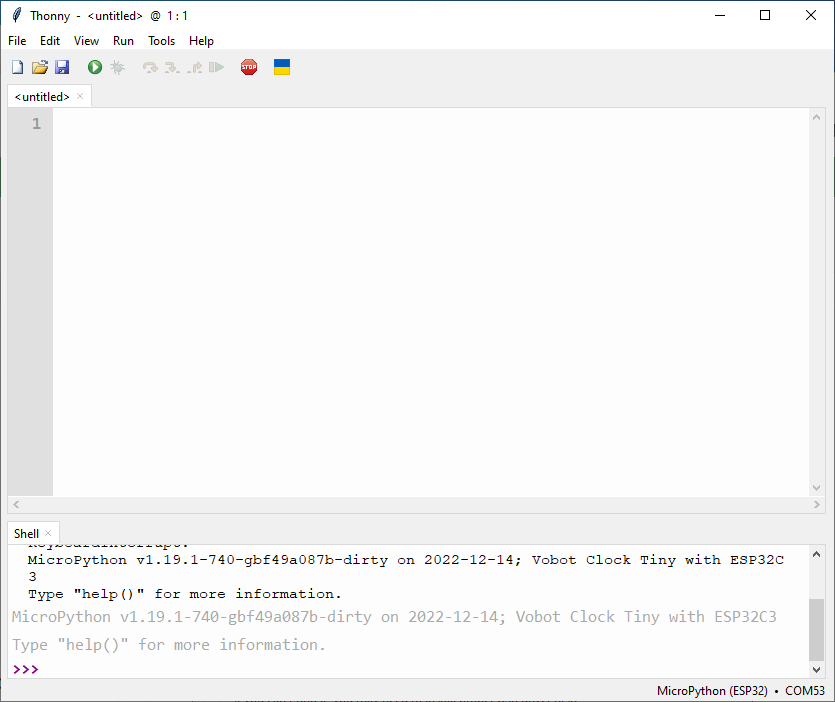<figcaption><p>connection succeeded</p></figcaption></figure>

* If the following error message appears after connection, please check whether the serial port driver is successfully installed in the device manager and whether the serial port number of the development board is selected correctly.

<figure>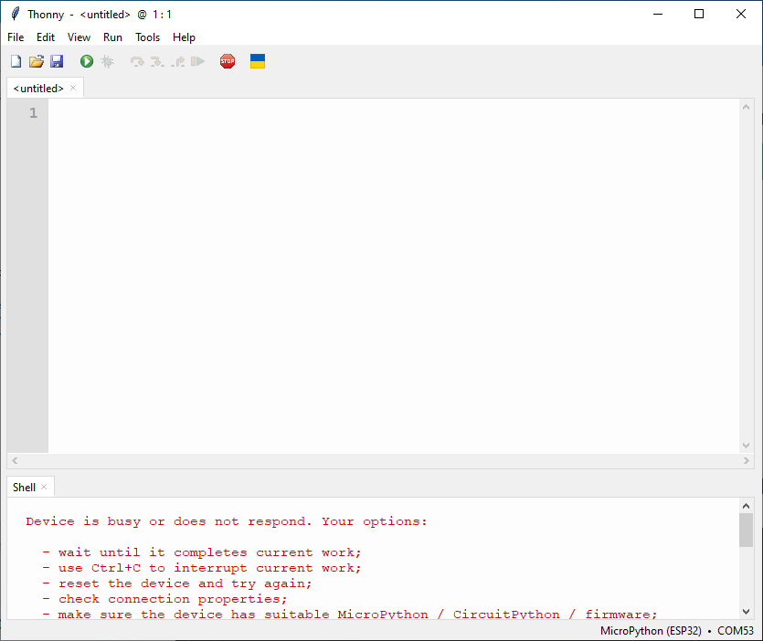<figcaption><p>connection error</p></figcaption></figure>

* If the driver is normal and the serial port number is selected correctly, then there is a factory program code running in **Vobot Clock Tiny** that blocks **IO**. At this time, you can click **Run—Interrupt Execution** to interrupt the program.

<figure>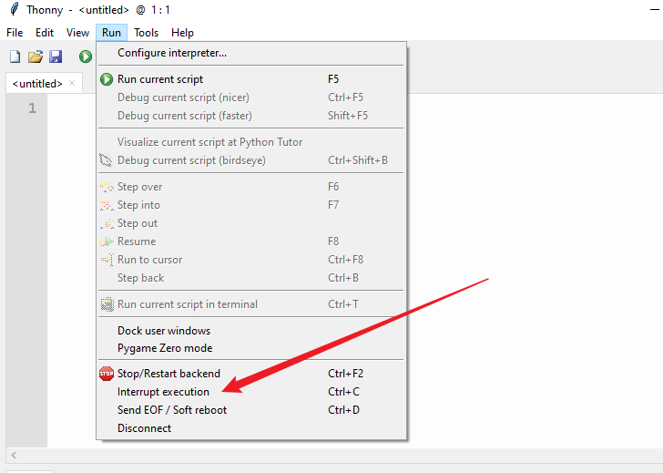<figcaption><p>interrupt program</p></figcaption></figure>

* Or directly power off and then power on to reset the development board ( **Vobot Clock Tiny** does not have a reset button), then press the **"Stop/Restart Backend Process"** button, and **REPL** will appear .

<figure>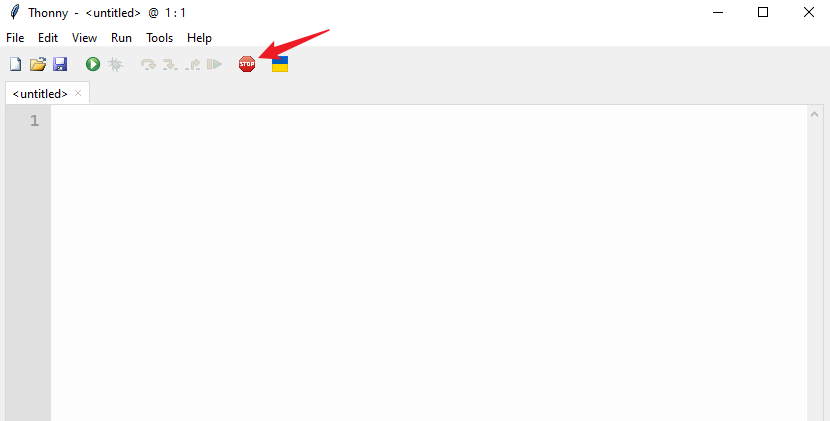<figcaption><p>restart process</p></figcaption></figure>

* If the above method does not work, please follow the firmware update chapter to re-burn the firmware.
* We enter `print("Hello Vobot Clock Tiny")` in the shell, press Enter, and you can see that the Hello Vobot Clock Tiny character is printed out:

<figure>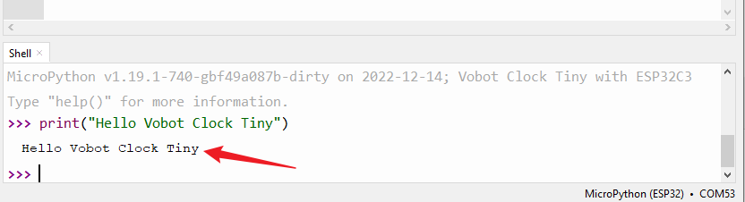<figcaption></figcaption></figure>

* Then enter `1+1` and press Enter:

<figure>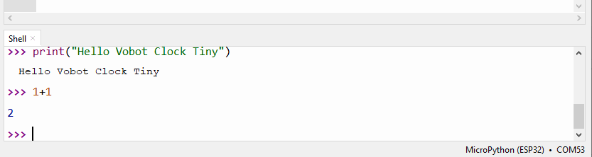<figcaption></figcaption></figure>

* Next, we input the following three lines of code line by line and press Enter line by line, and you can see that the LED light is also lit (there will be a detailed explanation for the LED control practice later):


```python
from machine import Pin
LED = Pin(2, Pin.OUT)
LED.value(1) 
```


<figure>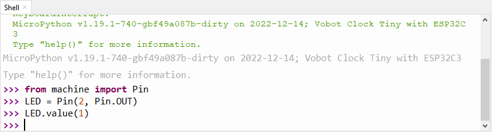<figcaption><p>Enter commands line by line</p></figcaption></figure>

<figure>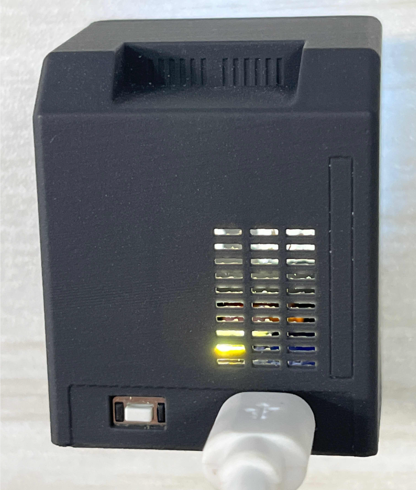<figcaption><p>LED lights are lit</p></figcaption></figure>

* **REPL** also has a powerful function of printing the wrong code to debug the program. When the following code is running, if the program makes an error, the error message will be printed through **REPL**.

<figure>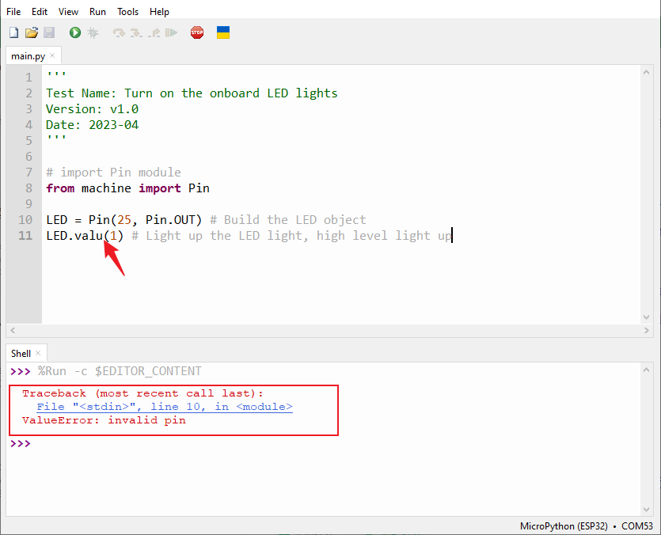<figcaption><p>error printing</p></figcaption></figure>

#### REPL terminal commonly used keyboard keys:

* Ctrl + C: Interrupt the running program (especially the code containing While True:)
* Ctrl + D : software reset development board

You can also use the thonny menu bar tool to implement interrupt or software reset functions:

<figure>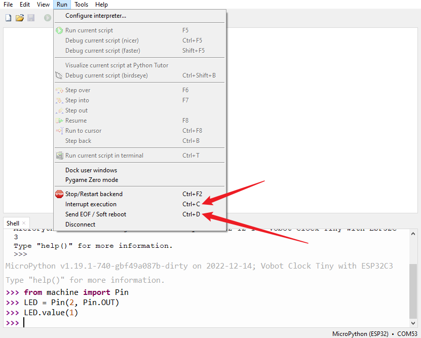<figcaption></figcaption></figure>

### File system

* Vobot Clock Tiny has a built-in file system, which can be simply understood as a python file that runs after power-on, which can be read and written very conveniently by Thonny.
* Click **View >>> Files**:

<figure>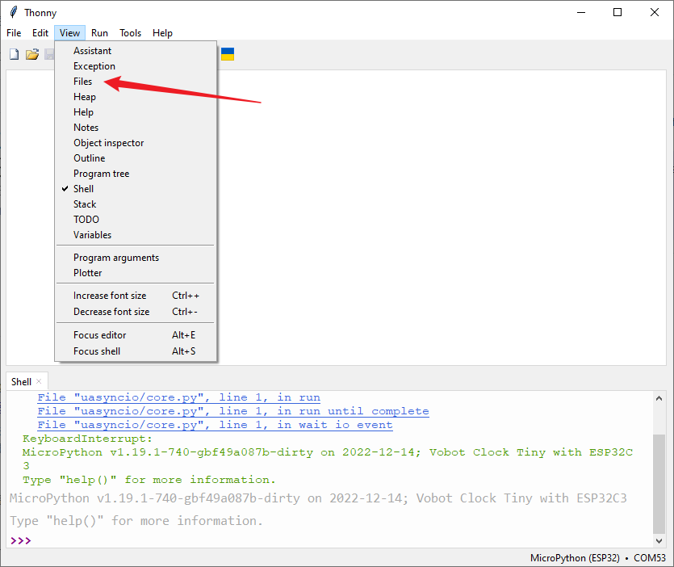<figcaption></figcaption></figure>

* You can see the real-time file browsing window of the local and development boards on the left:

<figure>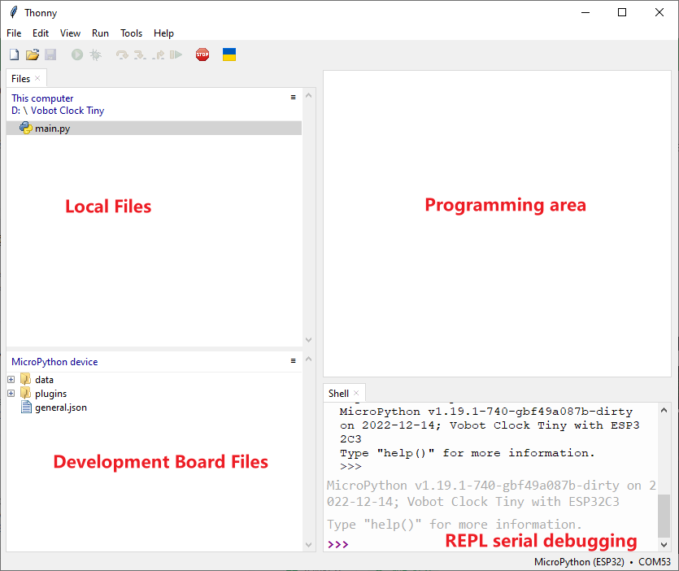<figcaption></figcaption></figure>

* In the local file **right-click >>> Upload to /** **plugins** to send the relevant files to the **plugins folder** of the development board, or send the files on the development board to Local and very convenient.

* Through the Drop-down list >>> Storage space of the MicroPython device, you can query all the Flash space and the remaining space of the development board.

* You can see that the total space of pyClock is 512 KB. That is, it can store py code, pictures or other files with a total size of 512 KB.

<figure>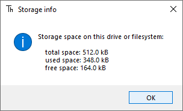<figcaption><p>device storage</p></figcaption></figure>

Code testing

* We have installed Thonny IDE and configuration before, and then we will use the simplest way to do an experiment of lighting up LED lights. You don’t need to understand the meaning of the code for the time being, and it will be explained in later chapters. This is mainly to let everyone understand the usage and principle of MicroPython programming software Thonny. The details are as follows:
   * Connect the development board, find the **main.py** file under the **Vobot Clock Tiny** folder in the local file area in the upper left corner of Thonny, double-click to open it, and see the relevant code in the programming area on the right.
   * The following is the written plug-in template, and subsequent modifications and practical applications are all modified on this basis:

```python
TITLE = "Template of Plugin"

async def on_boot(screen, config):
    # called right after system boot
    print('on init')

async def on_refresh(screen, config):
    # Once active, called by system every 200ms
    print('on refresh')


async def on_selected(screen, config):
    # User just pressed the button for 1 second
    print('on selected')


async def on_leave(screen, config):
    # User triggered to leave this plugin page, all function should be deactivated
    print('on leave')


async def on_enter(screen, config):
    # User triggered to enter this plugin page, all function should be activated
    print('on enter')

```

* In addition, the experimental code to light up the **LED** light is as follows:

```python
'''
Test Name: Turn on the onboard LED lights
Version: v1.0
Date: 2023-04
'''
# Import the corresponding module
from machine import Pin

# Apply plugin template
TITLE = "Template of Plugin"

async def on_boot(screen, config):
    # called right after system boot
    print('on init')
    LED = Pin(2, Pin.OUT)
    LED.value(1) # Light up the LED light, high level light up

async def on_refresh(screen, config):
    # Once active, called by system every 200ms
    pass

async def on_selected(screen, config):
    # User just pressed the button for 1 second
    pass

async def on_leave(screen, config):
    # User triggered to leave this plugin page, all function should be deactivated
    pass

async def on_enter(screen, config):
    # User triggered to enter this plugin page, all function should be activated
    pass
```

<figure>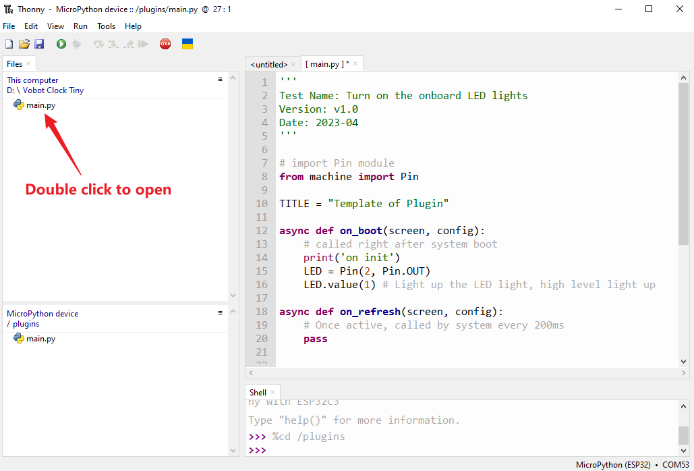<figcaption></figcaption></figure>

* Click **Run >>> Run current script** or directly **Click the green run button**: (When using the USB REPL on ESP32C3, it should be noted that the code cannot be run again after running, you need to "**Run > >> Interrupt execution**" to run again. Otherwise, the USB will hang up and need to be reconnected.)

<figure>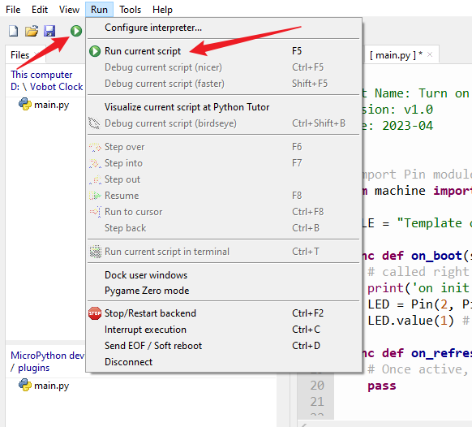<figcaption><p>run code</p></figcaption></figure>

* At this time, you can see that the **LED** light on the development board is lit:

<figure>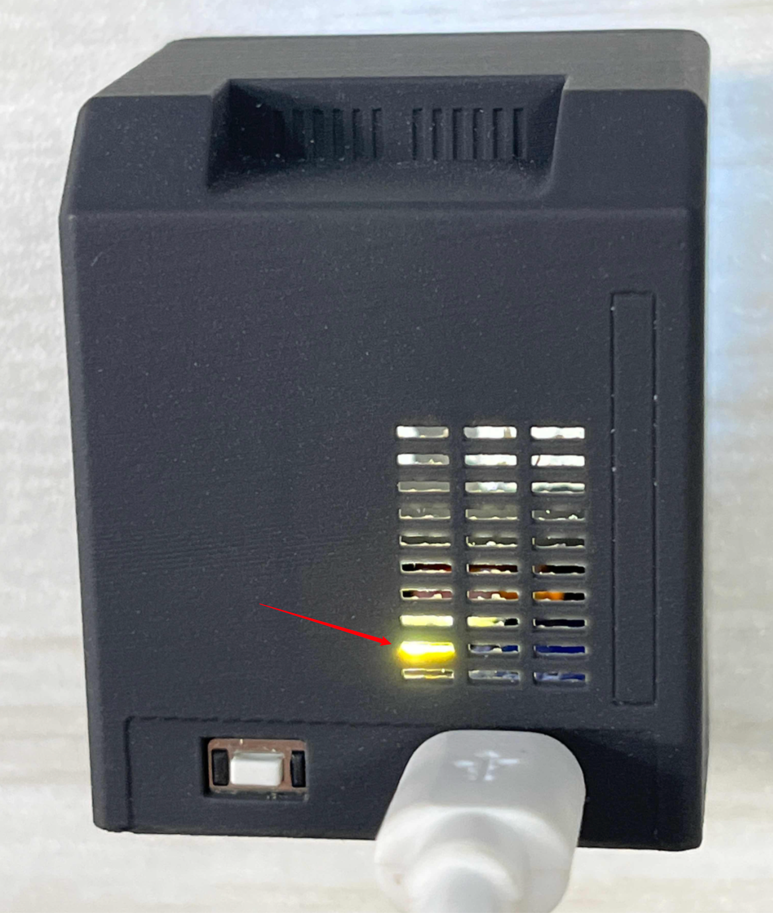<figcaption></figcaption></figure>

* The running function code is stored in the **RAM** (memory) of the development board, and will be lost after power off, so how to realize the development board to power on and run our code? Methods as below:
* **MicroPython** runs the file named **boot.py** by default when it is powered on, and then runs the **main.py** file. If there is no **boot.py**, then run **main directly. py**
* **boot.py:** is generally used to configure initialization parameters (may not be required);
* **main.py: **main program
* That is, we only need to send the code to the development board as a **main.py** file, then the development board can realize power-on and run related programs.
* We send the **main.py** of the **LED** routine to the board

<figure>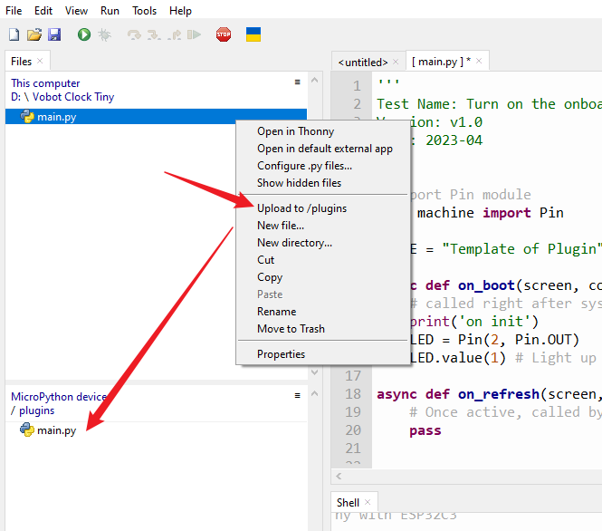<figcaption><p>Send the LED light code main.py to the development board</p></figcaption></figure>

* Re-plug the **USB** cable to reset **Vobot Clock Tiny** (**Vobot Clock Tiny** does not have a reset button, you need to power off and power on to reset), you can see **LED** The blue light is lit:

<figure><figcaption><p>Code runs offline</p></figcaption></figure>


# Based on Mac OS

## Thonny develops software

### Installing Thonny Development Software

* To install the development software Thonny, download the Mac version from [https://thonny.org/ ](https://thonny.org/):

<figure><figcaption></figcaption></figure>

## Development kit usage

* Since Thonny IDE can fully handle the programming and debugging functions of the development board, please refer to the Windows chapter [development Kit](based-on-windows.md) for usage.


# Based on Linux (Raspberry Pi)

## Thonny develops software

### Install development software Thonny

* Select the Linux version to download at [https://thonny.org/](https://thonny.org/), and follow the prompts to install:

<figure><figcaption></figcaption></figure>

* If you're using a Raspberry Pi board, the Thonny IDE comes pre-installed, so no additional installation is required.

## Development kit usage

Since Thonny IDE can fully handle the programming and debugging functions of the development board, please refer to the Windows chapter [development Kit](based-on-windows.md) for usage.