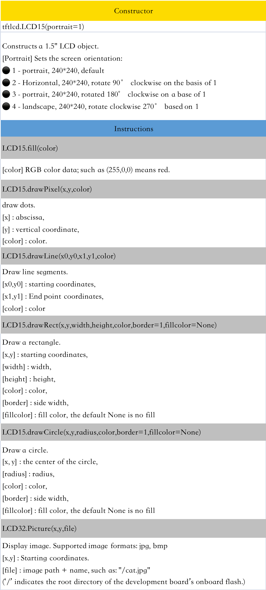
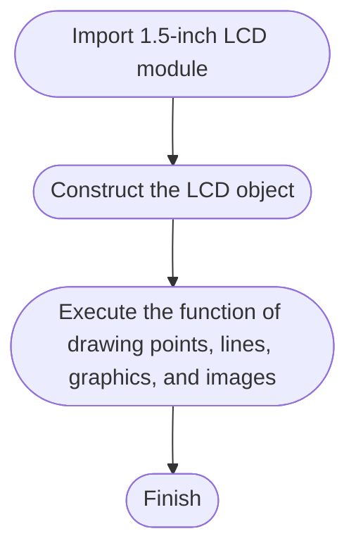
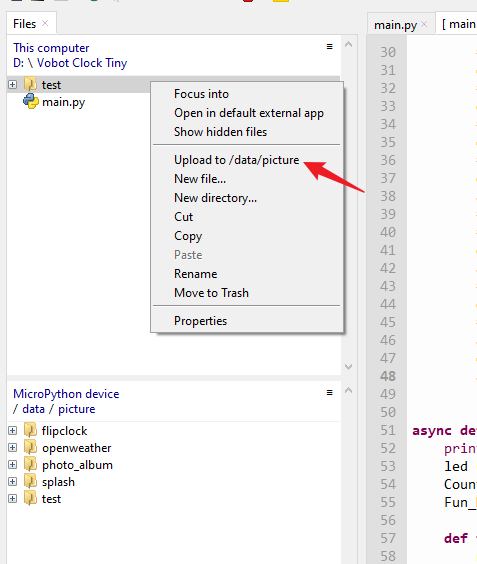
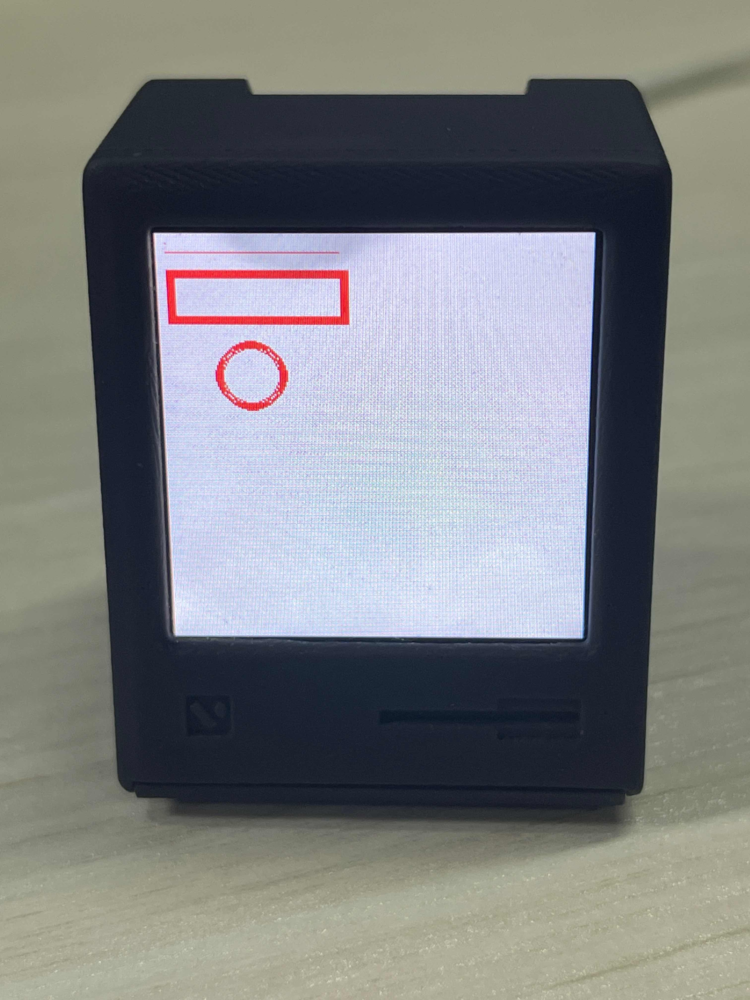
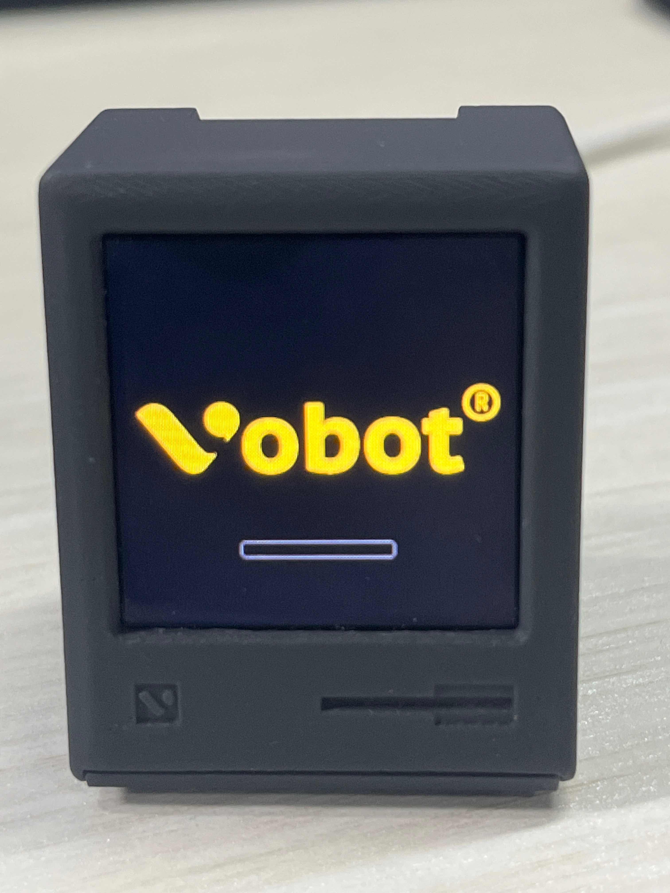
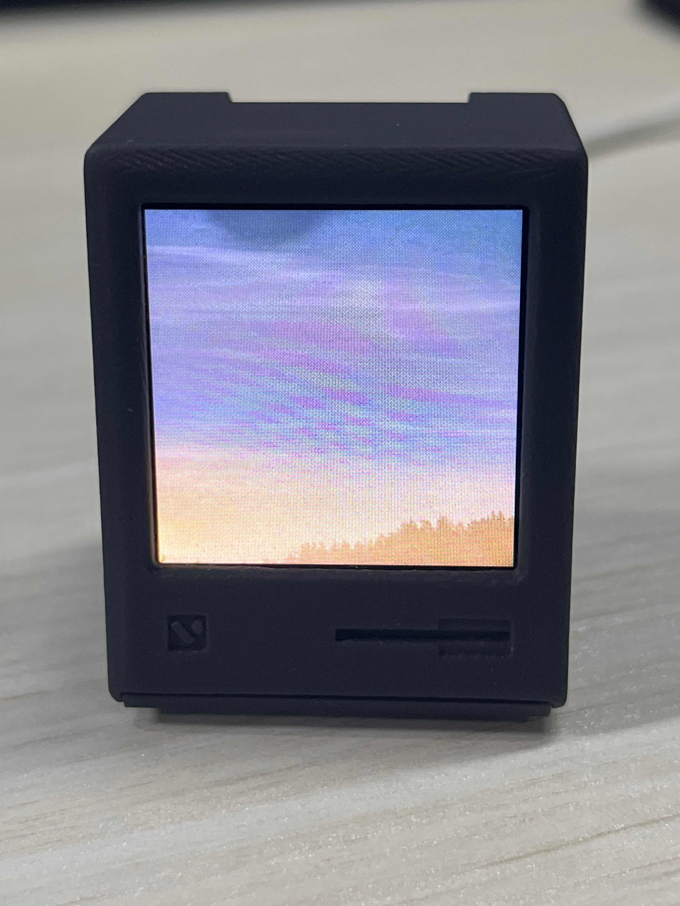
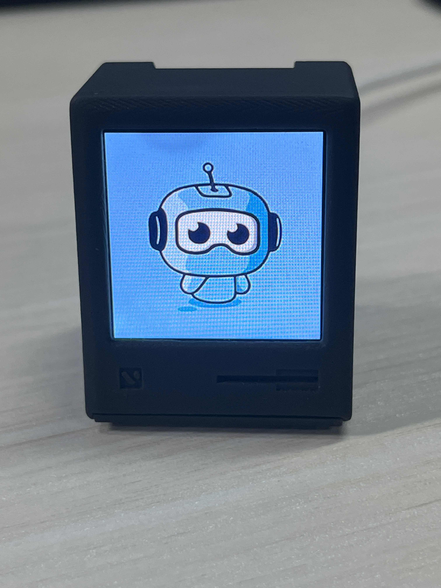

# LCD Display

### Preface:

* After using the key input device in the previous section, we will learn the output device LCD display in this section. In fact, the previous LED lights are also considered output devices, because they tell us exactly the status of the hardware. It's just that compared to LEDs that only turn on and off, the display can display more information and provide a better experience.

* This chapter is a bit more complicated, but we put it in the front to learn, because we learned how to use the display screen, so the playability will be stronger in the later experiments.

### Operating platform:

<figure><figcaption><p>Vobot Clock Tiny</p></figcaption></figure>

### Operation expected result:

* Through MicorPython programming, various display functions of the LCD are realized, including drawing points, lines, rectangles, circles, displaying pictures, etc.

### Implementation process

* Using MicroPython actually needs to do the above work (underlying development), but due to the characteristics of strong readability and portability, we only need to figure out how to use each object function. In general, the same as the previous experiment, there are constructors and function functions. The constructor solves the initialization problem, telling the development board how to connect the peripherals and the initialization parameters, while the function function solves the usage problem. We can directly call the relevant function functions based on our own needs to realize our own functions!
* We call the collection of these functions a driver, which can be pre-installed in the firmware, or stored in the development board file system through a .py file.

<figure><figcaption><p>Vobot Clock Tiny</p></figcaption></figure>

* With the above object constructor and instructions, programming can be said to be at your fingertips. Let's run all the above functions in use and first look at the programming flow chart:




### Refer to the main.py function code as follows:

```python
'''
Test Name: Realize various display functions of LCD through programming, including filling, drawing dots, lines, rectangles, circles, displaying pictures, etc.
Version: v1.0
Date: 2023-04
'''

#Import related modules
import machine
from tftlcd import LCD15
import time
import uasyncio as asyncio

TITLE = "Template of Plugin"

loopTask = None
async def loopRefresh():
    # Define common colors
    RED = (255,0,0)
    GREEN = (0,255,0)
    BLUE = (0,0,255)
    BLACK = (0,0,0)
    WHITE = (255,255,255)
    ########################
    # Construct and initialize a 1.5-inch LCD object
    ########################
    while True:
        d = LCD15(portrait=1) #Default orientation vertical screen
        # fill with white
        d.fill(WHITE)
        # draw point
        d.drawPixel(5, 5, RED)
        # draw line segment
        d.drawLine(5, 10, 100, 10, RED)
        #draw rectangle
        d.drawRect(5, 20, 100, 30, RED, border=5)
        # draw circle
        d.drawCircle(50, 80, 20, RED, border=5)
        await asyncio.sleep(5)#wait 5 seconds
        #display image
        d.Picture(0,0,"/data/picture/test/1.jpg")
        await asyncio.sleep(3)#wait 3 seconds
        d.Picture(0,0,"/data/picture/test/2.jpg")
        await asyncio.sleep(3)#wait 3 seconds
        d.Picture(0,0,"/data/picture/test/3.jpg")
        await asyncio.sleep(3)#wait 3 seconds


async def on_boot(screen, config):
    led = machine.Pin(2, machine.Pin.OUT)
    Counter = 0
    Fun_Num = 0
    
    # Define a callback function to control the blinking of the LED light
    def fun(timer):
        nonlocal Counter
        # Control the LED light on and off according to the parity of the Counter
        Counter += 1
        # Print the value of Counter
        print(Counter)
        led.value(Counter % 2)

    tim = machine.Timer(0) # create timer
    # Initialize the timer, the period is 1000 milliseconds, the mode is periodic, and the callback function is set to fun
    tim.init(period=1000, mode=machine.Timer.PERIODIC, callback=fun)


async def on_selected(screen, config):
    # User just pressed the button for 1 second
    pass


async def on_leave(screen, config):
    global loopTask
    # Judging the loopTask status
    # If it is empty, it means that there is no running task, and the function returns directly.
    # If not null, a further check to see if the task has completed. If the task is not complete then do the following
    if loopTask != None:
        if not loopTask.done():
            print("loopTask end")
            loopTask.cancel()
            loopTask = None

async def on_enter(screen, config):
    global loopTask
    # Judge the status of loopTask to cycle refresh the LCD display content.
    if loopTask is None:
        print("loopTask start")
        loopTask = asyncio.create_task(loopRefresh())

async def on_refresh(screen, config):
    # Once active, called by system every 200ms
    pass

```

### 操作结果：

* 将示例程序的素材文件上传到 **Vobot Clock Tiny** 开发板。**（也可以只上传单张图片）**

<figure><figcaption></figcaption></figure>

* 运行程序，可以看到 **LCD** 依次显示相关内容。

<figure><figcaption></figcaption></figure>

<figure><figcaption></figcaption></figure>

<figure><figcaption></figcaption></figure>

<figure><figcaption></figcaption></figure>
