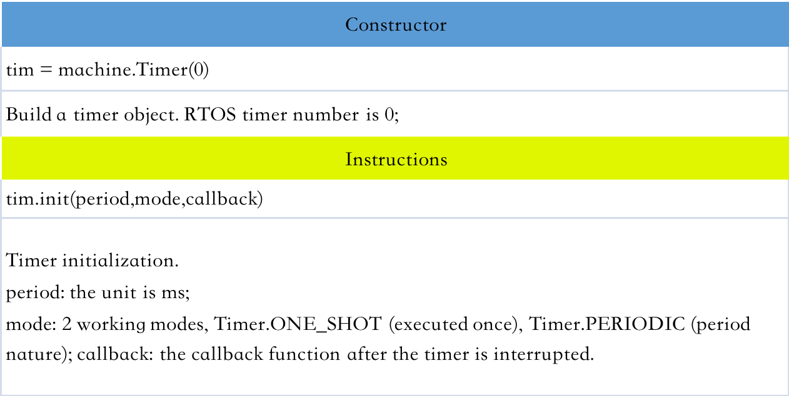
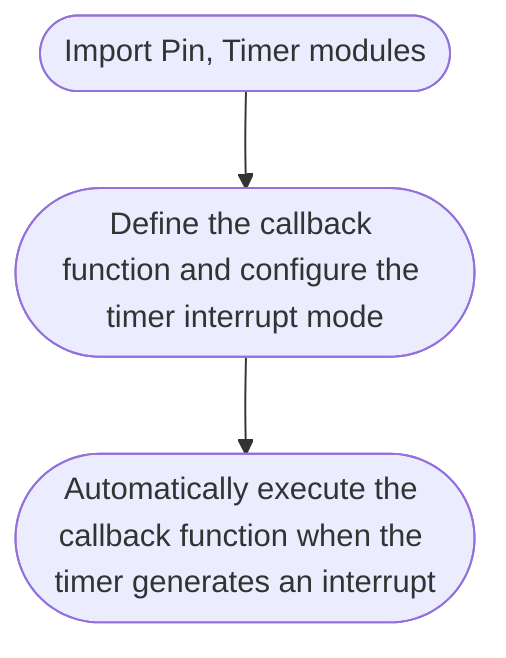
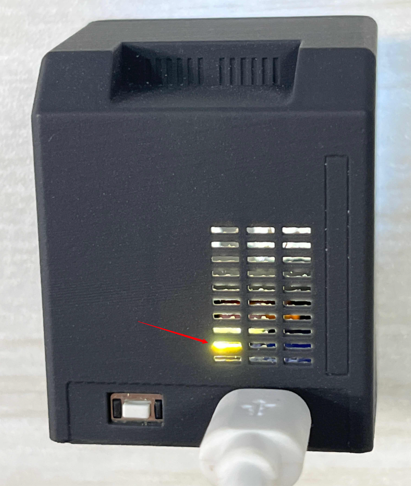

# Timer

### Preface:

* Timer, as the name suggests, is used for timing. We often set a timer or an alarm clock, and then tell us what to do when the time is up. The same is true for single-chip microcomputers, which can complete various preset tasks through timers.

### Operating platform:

<figure><figcaption><p>Vobot Clock Tiny</p></figcaption></figure>

### Operation expected result:

* Make the LED blink 1 time per second periodically through a timer.

### Implementation process

* ESP32 has a built-in RTOS (Real Time Operating System) timer. In the Timer module of machine. It can be easily used programmatically through MicroPython. We also only need to understand its construction object function and use method!

<figure><figcaption><p>Vobot Clock Tiny</p></figcaption></figure>


* When the timer reaches the preset specified time, an interrupt will also be generated, so it is similar to the programming method of the external interrupt, Similarly, the code programming flow chart is as follows:




### Refer to the main.py function code as follows:

```python
'''
Test Name: Make the LED blink 1 time per second periodically through a timer
Version: v1.0
Date: 2023-04
'''

# import Pin、Timer module
from machine import Pin, Timer

TITLE = "Template of Plugin"

async def on_boot(screen, config):
    led = machine.Pin(2, machine.Pin.OUT)
    Counter = 0
    Fun_Num = 0
    
    # Define a callback function to control the blinking of the LED light
    def fun(timer):
        nonlocal Counter
        # Control the LED light on and off according to the parity of the Counter
        Counter += 1
        # Print the value of Counter
        print(Counter)
        led.value(Counter % 2)

    tim = machine.Timer(0) # create timer
    # Initialize the timer, the period is 1000 milliseconds, the mode is periodic, and the callback function is set to fun
    tim.init(period=1000, mode=machine.Timer.PERIODIC, callback=fun)


async def on_refresh(screen, config):
    # Once active, called by system every 200ms
    pass

async def on_selected(screen, config):
    # User just pressed the button for 1 second
    pass

async def on_leave(screen, config):
    # User triggered to leave this plugin page, all function should be deactivated
    pass

async def on_enter(screen, config):
    # User triggered to enter this plugin page, all function should be activated
    pass

```

### 操作结果：

<figure><figcaption><p>LED 以周期 1 秒的间隔闪烁</p></figcaption></figure>
