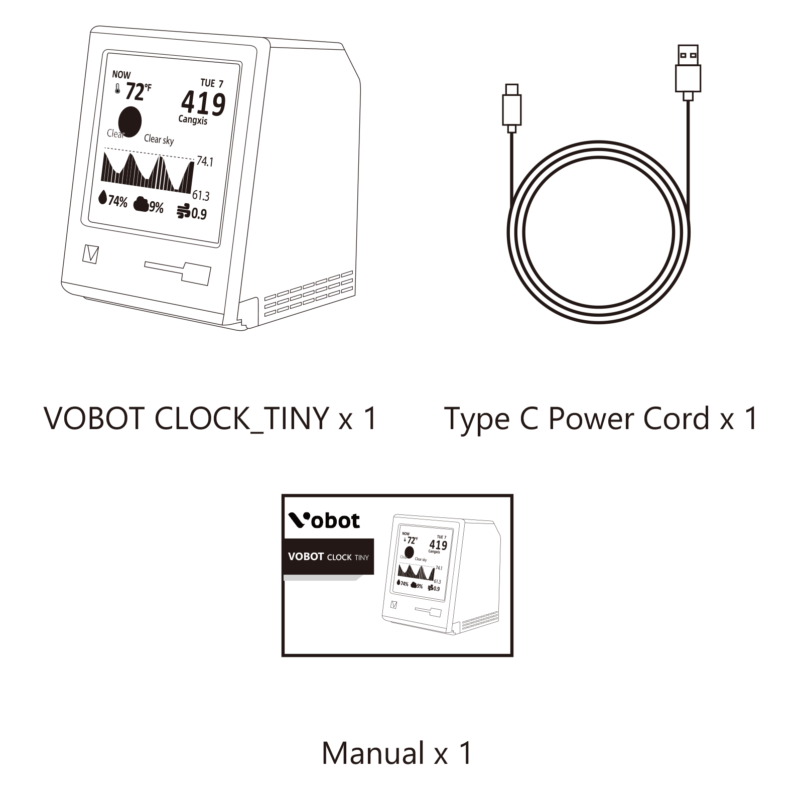
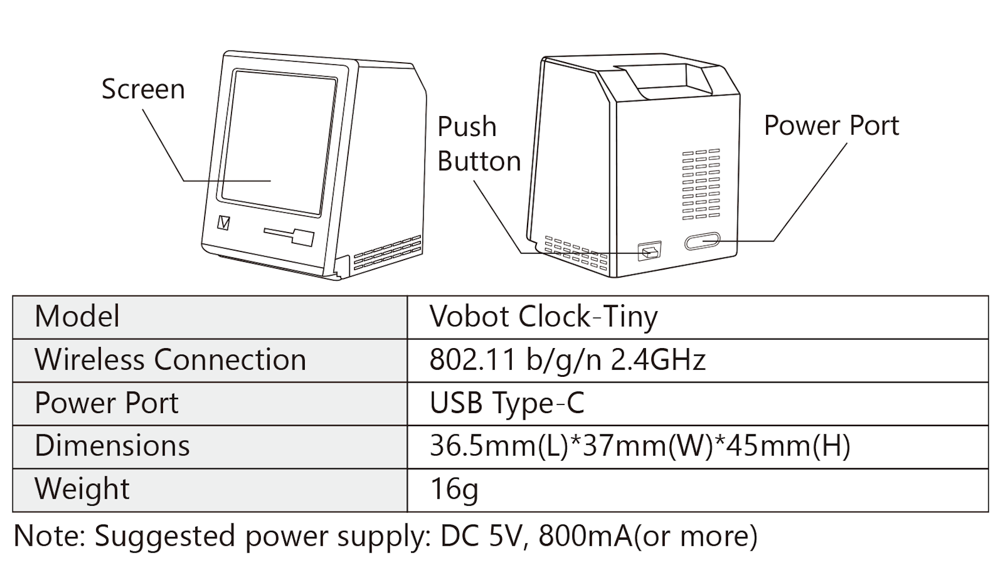
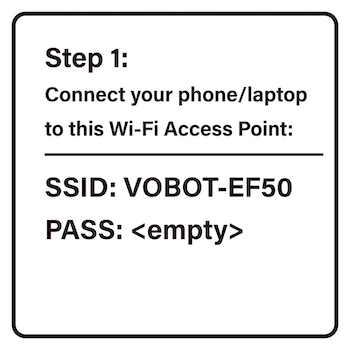
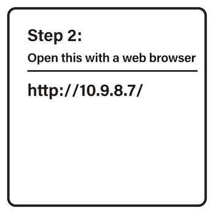
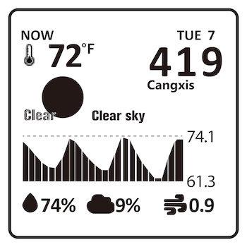
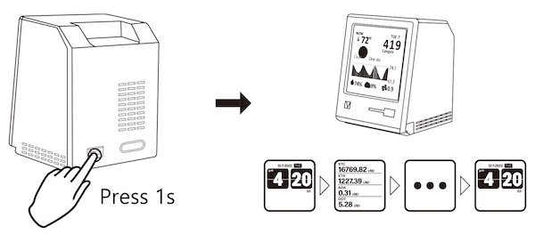
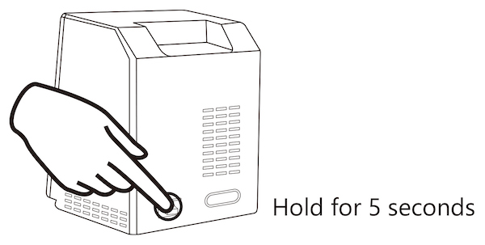
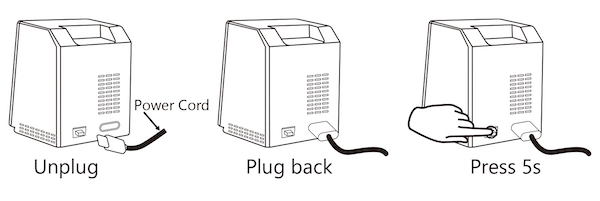

# Introduction

* Vobot Clock Tiny is a sleek tabletop decoration that relieves stress while decorating desks and study rooms.
* It has the following functions:
   * As as a weather station: displays temperature, humidity and weather conditions in your area
   * As a clock: it can display time, hour/minute/second, month/day/year and week.
   * As a cryptocurrency price profile: shows current prices for Bitcoin, Ethereum, AdHive, Polkadot
   * As a developer board: users with development capabilities can compile firmware by themselves and download it to the device
   * More features will be provided in the future

## Specification

#### Product packaging

<figure><figcaption></figcaption></figure>

#### Product specification

<figure><figcaption>
<strong>Vobot Clock Tiny</strong> resource description
</figcaption></figure>

* Main controller: ESP32-C3, support WiFi/BLE
* Flash: 4Mbytes
* 1 x 1.54 inch display (resolution 240 x 240)
* 1 x LED (blue light)
* 1 x button
* 1 x Sensor interface (XH-1.25mm-3P)
* 1 x Type-C (download/debug/power supply)

## Basic Setup

### Setup

1. Connect your Phone/Tablet/Laptop/PC to the wireless hotspot (AP) displayed on the screen.

<figure><figcaption></figcaption></figure>

2. Visit the IP address shown on the screen with your Phone/Tablet/Laptop/PC IP Address: http://10.9.8.7/

<figure><figcaption></figcaption></figure>

3. Select the Wi-Fi SSID you prefer to connect the device to. (Note: Support 2.4 GHz Hotpot Only)
4. Fill the Wi-Fi password of the Wi-Fi SSID that you selected, and other address information needed. (Note: Case-sensitive)
5. Click "Connect to WiFi", and then the device will verify if it can connect to the assigned Wi-Fi, and check if the City/State/Region is Valid. Once the geolocation and time zone information was fetched successfully, the setup is completed.

<figure><figcaption></figcaption></figure>

### Button Operation

#### Switching UI Pages

* During the normal operation, by short pressing the button, the UI will switch to the next page (plugin). Sometimes it will prompt to hold the button for 0.5 second to confirm an operation.

<figure><figcaption></figcaption></figure>

#### Restore to Factory Default

* Press and hold the button for about 5 seconds, until the screen shows "Restoring to factory default", and then release the button.

<figure><figcaption></figcaption></figure>

#### Regular Firmware Update

* On the firmware update page, if the new version is available, you may press and hold the button for about 1 second to enter the network update mode.
* The firmware update needs to connect to a Wi-Fi hotspot, please wait until the screen shows that the update is completed, and the device will automatically reboot.
* If the upgrade process is interrupted or gets stuck, you need to re-plug the power supply to try again.

#### Rescue Mode

* In case the system completely crashes (rarely happens), you may use the rescue mode to completely recover to the latest firmware version, here is how:
  * Create a temporary WiFi hotspot: factory/12345678&
  * Unplug the power cord, and right after plug back, immediately press the button and hold it for more than 5 seconds. At this time, it will erase the configuration and existing firmware. Then it connects to the Wi-Fi hotspot and downloads the latest version of firmware.

<figure><figcaption></figcaption></figure>

#### Advanced

* This device is made of ESP32-C3 chipset. You can DIY your firmware totally by yourself and write it into the device over USB port (USB Serial CDC UART).
* To flash your firmware, press and hold the button first, then plug in the power supply. Then release the button. At this point, the device enters the Download mode.
* However, all firmware and data will get lost in this case, and the rescue mode and OTA feature will no longer be available.
* We recommend to use Thonny (Python IDE) for beginners to manage the configuration file and write your plugins.
