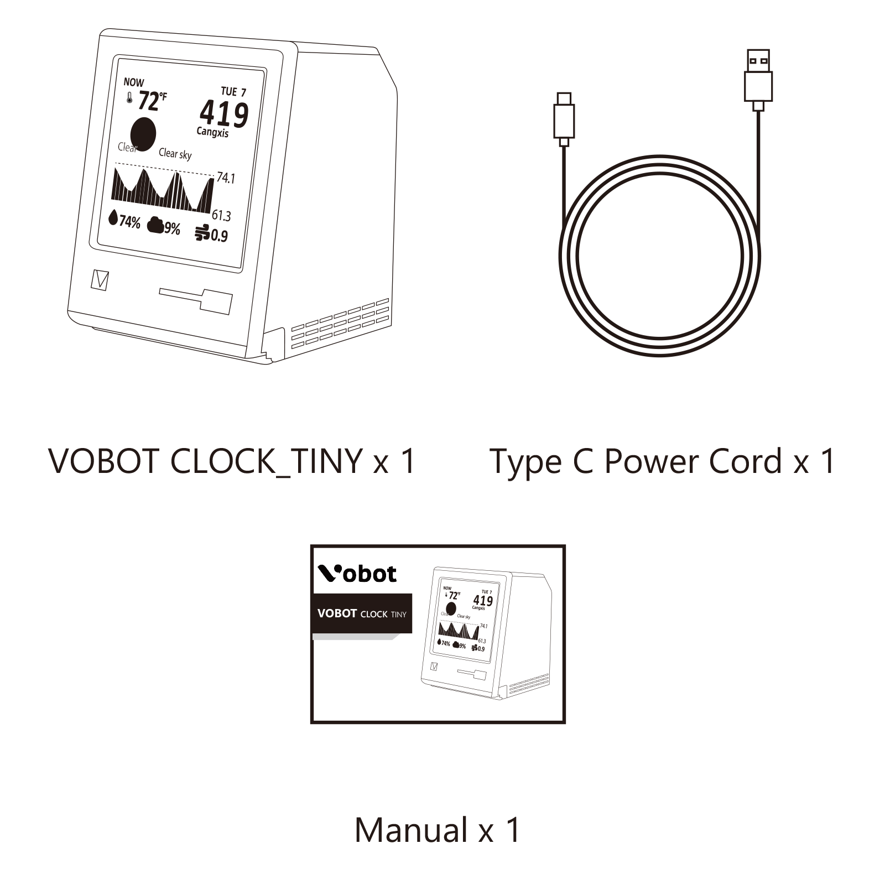

# Specification

### Product packaging

<figure><figcaption></figcaption></figure>

### Product specification

<figure><figcaption>
<strong>Vobot Clock Tiny</strong> resource description
</figcaption></figure>

* Main controller: ESP32-C3, support WiFi/BLE
* Flash: 4Mbytes
* 1 x 1.54 inch display (resolution 240 x 240)
* 1 x LED (blue light)
* 1 x button
* 1 x Sensor interface (XH-1.25mm-3P)
* 1 x Type-C (download/debug/power supply)
